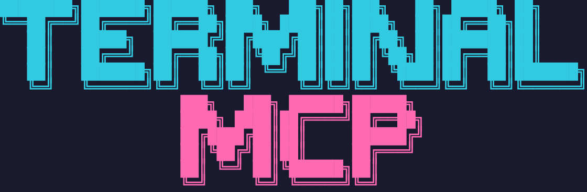

<p align="center">
  
</p>

<p align="center">
  <strong>Let AI see and interact with your terminal.</strong>
</p>

<p align="center">
  Terminal MCP gives LLMs a shared view of your terminal session. Perfect for debugging CLIs and TUI applications in real-time, or letting AI drive terminal-based tools autonomously.
</p>

## Install

```bash
npm install -g @ellery/terminal-mcp
```

Or via install script:

```bash
curl -fsSL https://raw.githubusercontent.com/elleryfamilia/terminal-mcp/main/install.sh | bash
```

## Features

- **Full Terminal Emulation**: Uses xterm.js headless for accurate VT100/ANSI emulation
- **Cross-Platform PTY**: Native pseudo-terminal support via node-pty (macOS, Linux, Windows)
- **MCP Protocol**: Implements Model Context Protocol for AI assistant integration
- **Simple API**: Four intuitive tools for complete terminal control

## Installation

```bash
# Install dependencies
npm install

# Build
npm run build
```

## Usage

### MCP Configuration

Add to your MCP client settings:

```json
{
  "mcpServers": {
    "terminal": {
      "command": "terminal-mcp"
    }
  }
}
```

With custom options:

```json
{
  "mcpServers": {
    "terminal": {
      "command": "terminal-mcp",
      "args": ["--cols", "100", "--rows", "30", "--shell", "/bin/zsh"]
    }
  }
}
```

### Command-Line Options

```
terminal-mcp [OPTIONS]

Options:
  --cols <number>   Terminal width in columns (default: 120)
  --rows <number>   Terminal height in rows (default: 40)
  --shell <path>    Shell to use (default: $SHELL or bash)
  --help, -h        Show help message
```

## MCP Tools

### `type`
Send text input to the terminal.

```json
{
  "name": "type",
  "arguments": {
    "text": "echo hello"
  }
}
```

### `sendKey`
Send special keys or key combinations.

```json
{
  "name": "sendKey",
  "arguments": {
    "key": "Enter"
  }
}
```

Supported keys:
- Basic: `Enter`, `Tab`, `Escape`, `Backspace`, `Delete`
- Arrow: `ArrowUp`, `ArrowDown`, `ArrowLeft`, `ArrowRight`
- Navigation: `Home`, `End`, `PageUp`, `PageDown`, `Insert`
- Function: `F1` through `F12`
- Control: `Ctrl+A` through `Ctrl+Z`, `Ctrl+C`, `Ctrl+D`, etc.

### `getContent`
Get the terminal buffer as plain text.

```json
{
  "name": "getContent",
  "arguments": {
    "visibleOnly": false
  }
}
```

### `takeScreenshot`
Capture the terminal state with cursor position and dimensions.

```json
{
  "name": "takeScreenshot",
  "arguments": {}
}
```

## Architecture

```
MCP Client (Claude Code, etc.)
    │ STDIO (JSON-RPC)
    ▼
Terminal MCP Server (Node.js)
    ├── MCP SDK (@modelcontextprotocol/sdk)
    ├── Terminal Emulator (@xterm/headless)
    └── PTY Manager (node-pty)
            │
            ▼
        Shell Process (bash, zsh, etc.)
```

## Example Session

```bash
# Type a command
{"jsonrpc":"2.0","id":1,"method":"tools/call","params":{"name":"type","arguments":{"text":"ls -la"}}}

# Send Enter key
{"jsonrpc":"2.0","id":2,"method":"tools/call","params":{"name":"sendKey","arguments":{"key":"Enter"}}}

# Get the output
{"jsonrpc":"2.0","id":3,"method":"tools/call","params":{"name":"getContent","arguments":{}}}
```

## Development

### Project Structure

```
terminal-mcp/
├── src/
│   ├── index.ts              # Entry point with CLI
│   ├── server.ts             # MCP server setup
│   ├── terminal/
│   │   ├── index.ts          # Exports
│   │   ├── session.ts        # PTY + xterm integration
│   │   └── manager.ts        # Session lifecycle
│   ├── tools/
│   │   ├── index.ts          # Tool registry
│   │   ├── type.ts           # type tool
│   │   ├── sendKey.ts        # sendKey tool
│   │   ├── getContent.ts     # getContent tool
│   │   └── screenshot.ts     # takeScreenshot tool
│   └── utils/
│       └── keys.ts           # Key code mappings
├── docs/                     # Documentation
├── package.json
└── tsconfig.json
```

### Building

```bash
npm run build    # Compile TypeScript
npm run dev      # Run with tsx (development)
```

## Documentation

See the [docs](./docs/) folder for detailed documentation:

- [Overview](./docs/index.md)
- [Installation](./docs/installation.md)
- [Tools Reference](./docs/tools.md)
- [Configuration](./docs/configuration.md)
- [Examples](./docs/examples.md)
- [Architecture](./docs/architecture.md)

## Requirements

- Node.js 18.0.0 or later
- Build tools for native module compilation (node-pty)

## License

MIT
